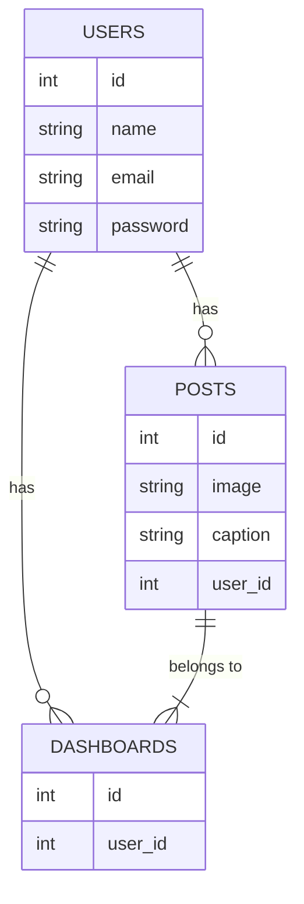
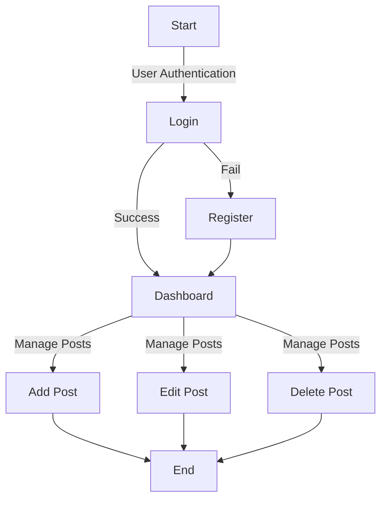
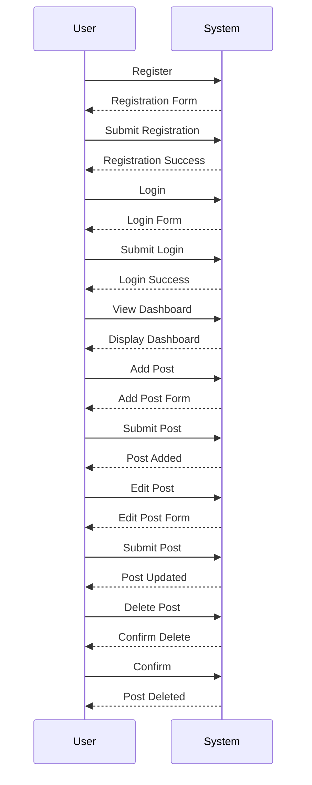

# Tanjung Mulia Informatika Technical Test

This project is a Laravel 11 application using Admin LTE v3, MySQL 8, and Tailwind CSS. It includes features for user authentication, a dashboard, and the ability for users to upload multiple posts.

## Installation

### Prerequisites
- PHP 8.0 or higher
- Composer
- Node.js & npm
- MySQL 8

### Steps
1. Clone the repository:
    ```sh
    git clone https://github.com/yourusername/tanjung-mulia-informatika-technical-test.git
    cd tanjung-mulia-informatika-technical-test
    ```

2. Install PHP dependencies:
    ```sh
    composer install
    ```

3. Install Node dependencies:
    ```sh
    npm install
    ```

4. Copy `.env.example` to `.env` and configure your database settings:
    ```sh
    cp .env.example .env
    ```

5. Generate application key:
    ```sh
    php artisan key:generate
    ```

6. Run database migrations:
    ```sh
    php artisan migrate
    ```

7. Serve the application:
    ```sh
    php artisan serve
    ```

## Features
- User Authentication (Login, Register, Logout)
- Dashboard
- Post Management (CRUD)
- Users can upload multiple posts

## Usage
1. Register a new user or log in with an existing account.
2. Access the dashboard to manage posts.
3. Upload, edit, or delete posts.

## ERD


## Flowchart



## Activity Diagram


## Contributing
This project is for demonstration and technical test purposes. However, feedback and suggestions are welcome.

## Contact
Adisa Laras Pertiwi - adisalaras41@gmail.com
